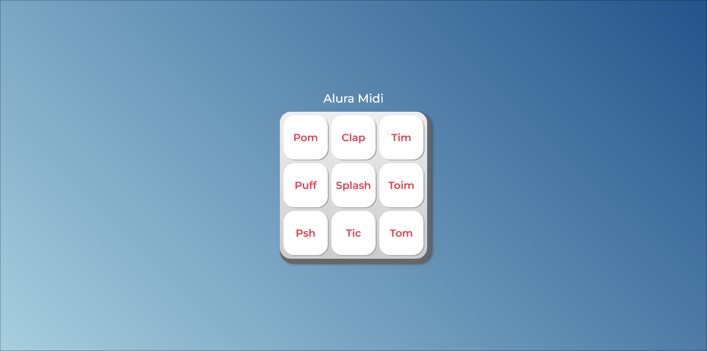

# Aluramid

> Status do projeto: Concluído :white_check_mark:

Simples projeto onde é criado um MIDI - Interface Digital do Instrumento Musical focando no desenvolvimento do JavaScript.

## Overview

### Link

- Live site URL: [Live](https://pedrodcastro.github.io/aluramid/)
